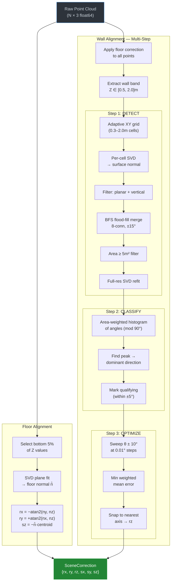
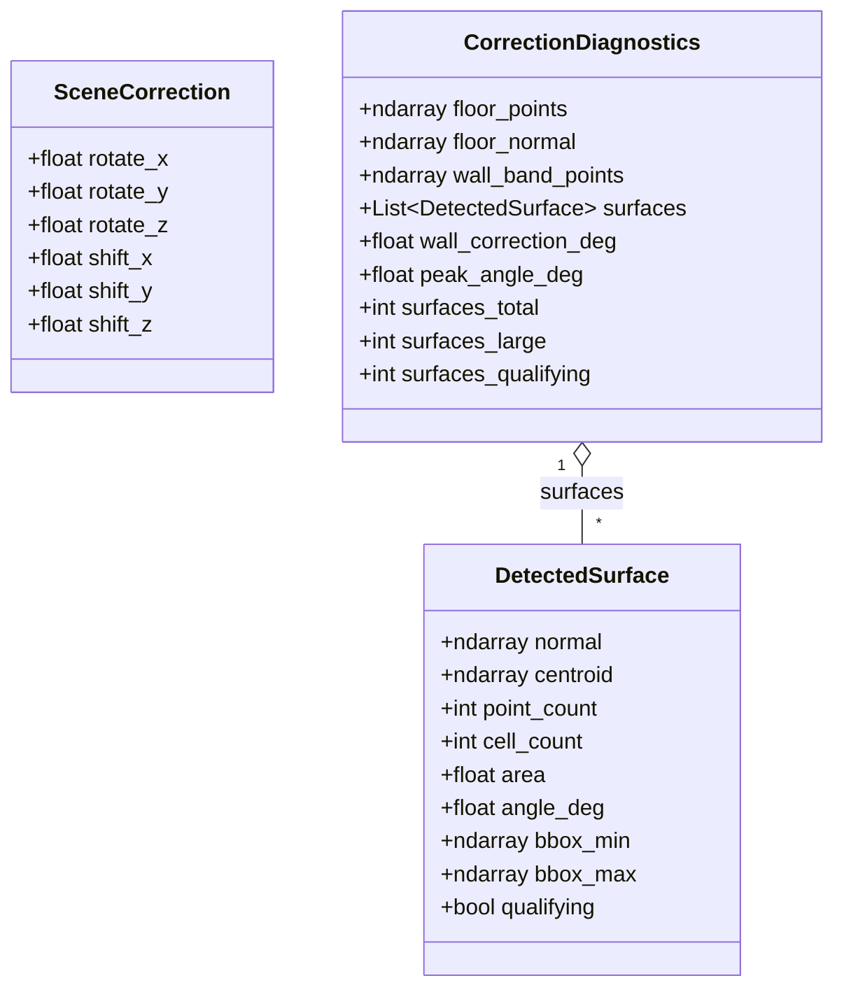
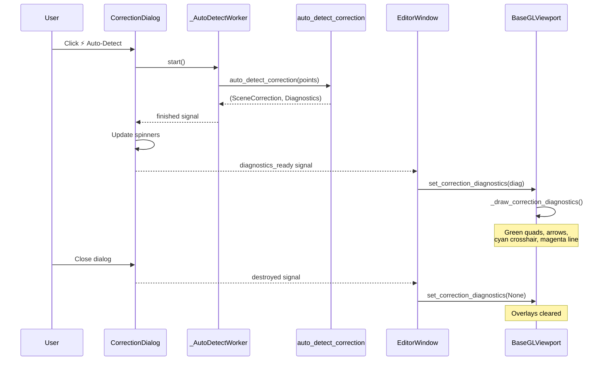

# Scene Correction Architecture

The scene correction system aligns raw 3D scanner data to world axes so that the floor lies at Z=0 and walls run parallel to the X and Y axes. It produces six correction values (three rotations, three shifts) that are applied as a global transform before rendering.

## Correction Parameters

| Parameter    | Axis  | Determined by     | Purpose                              |
|-------------|-------|-------------------|--------------------------------------|
| `rotate_x`  | X     | Floor normal (YZ)  | Level the floor (pitch correction)   |
| `rotate_y`  | Y     | Floor normal (XZ)  | Level the floor (roll correction)    |
| `rotate_z`  | Z     | Wall alignment     | Align walls to grid (yaw correction) |
| `shift_z`   | Z     | Floor plane offset | Bring floor to Z=0                   |
| `shift_x/y` | X/Y   | Optional centering | Center the scene at the origin       |

---

## Detection Pipeline



---

## Floor Detection

The simplest step. Given N points:

1. **Select** points with Z ≤ `percentile(Z, 5%)` — these are the floor candidates.
2. **SVD** on the centered floor points gives three singular vectors; the third (smallest σ) is the floor **normal** n̂.
3. Since the floor should be horizontal (n̂ ≈ [0, 0, 1]), the tilt components give:
   - `rotate_x = −atan2(n̂y, n̂z)` (corrects pitch)
   - `rotate_y = +atan2(n̂x, n̂z)` (corrects roll)
4. The floor plane equation n̂·p + d = 0 gives `shift_z = d` (translates floor to Z=0).

---

## Wall Detection — Step 1: Detect Large Surfaces

### Adaptive Cell Grid

The XY plane is divided into square cells. Cell size adapts to point density:

```
cell_size = clamp(sqrt(40 / density), 0.3, 2.0)
```

where `density = N_wall_band / XY_area`. This ensures ~40+ points per cell regardless of scan density.

### Per-Cell Normal Estimation

For each cell with ≥ 20 points:
1. **SVD** on centered cell points → singular values [σ₁, σ₂, σ₃] and vectors [v̂₁, v̂₂, v̂₃]
2. **Planarity check**: σ₃/σ₂ < 0.3 (the smallest spread is much less than the middle → planar)
3. **Verticality check**: |v̂₃ · ẑ| < 0.25 (the surface normal has small Z component → wall, not floor/ceiling)

### Flood-Fill Merge

Adjacent vertical cells are merged into surfaces via BFS:
- **8-connectivity** (including diagonal neighbors) — important for walls at angles like 45° where cells are diagonal
- **Angle tolerance**: each candidate neighbor's normal angle must be within ±15° of the **seed cell's** angle (mod 90°). Comparing to the seed (not the immediate neighbor) prevents angle drift along long walls.

### Area Computation

Surface area is estimated from the bounding box:

```
area = sqrt(Δx² + Δy²) × Δz
```

where (Δx, Δy, Δz) is the bounding box span. Only surfaces ≥ 5 m² proceed.

### Full-Resolution Refinement

Each large surface's normal is refined using the **full** point cloud (not the decimated cells):

1. Collect all wall-band points within the surface's bounding box + one cell margin
2. Filter to **inliers** within 10 cm of the initial cell-based plane
3. **SVD** on the full-resolution inlier set → refined normal with maximum precision

This matters because the initial cell-based normals use only sparse subsets, while the full-resolution refit may use tens of thousands of points.

---

## Wall Detection — Step 2: Classify

### Angle Histogram

The angle of each large surface's normal is computed as:

```
angle = atan2(ny, nx)  mod 90°
```

The `mod 90°` operation collapses both parallel walls (differ by 180°) and perpendicular walls (differ by 90°) to the same angle. This is because:
- Normal at 13° → mod 90° = 13°
- Opposite normal at 193° → flipped to 13° (we enforce nx > 0), mod 90° = 13°
- Perpendicular normal at 103° → flipped to −77° (atan2), mod 90° = 13°

An area-weighted histogram (360 bins, 0–90°) with 5-point smoothing finds the **dominant wall direction** as its peak.

### Qualifying Filter

Surfaces whose angle is within ±`angle_tolerance` (default 5°) of the dominant direction are **qualifying**. These contribute to the final rotation. Non-qualifying surfaces (columns, equipment, angled objects, curved surfaces) are excluded.

---

## Wall Detection — Step 3: Optimize

A sweep of candidate angles θ around the dominant direction (±10°, 2001 steps = 0.01° resolution):

```
error(θ) = Σᵢ area_i × min(|angle_i − θ| mod 90, 90 − |angle_i − θ| mod 90)
```

The θ with minimum error is the optimal wall direction. To produce a correction:
- If θ > 45°: correction = −(θ − 90°)
- If θ ≤ 45°: correction = −θ

This snaps walls to the nearest axis (either X or Y).

---

## Data Model



---

## Integration Architecture



---

## Debug Visualization

The viewport overlays are drawn in `_draw_correction_diagnostics()` after all scene layers, with lighting disabled and alpha blending enabled.

| Layer | GL Primitive | Color | Opacity |
|-------|-------------|-------|---------|
| Wall-band points | `GL_POINTS` (1.5px) | Yellow | 0.08 |
| Qualifying surfaces | `GL_QUADS` + `GL_LINE_LOOP` | Green | 0.35 |
| Non-qualifying large surfaces | `GL_QUADS` + `GL_LINE_LOOP` | Orange | 0.20 |
| Surface normals (top 20) | `GL_LINES` (2.5px) | Green/Orange | 1.0 |
| Target axes (Z=0) | `GL_LINES` (5px) | Cyan | 0.9 |
| Current wall direction (Z=0) | `GL_LINES` (4px) | Magenta | 0.8 |

All overlays render in **corrected scene space** (after the scene correction transform is applied), so they align with the corrected point cloud.

---

## File Locations

| File | Contents |
|------|----------|
| `analysis/scene_correction.py` | Detection algorithm, diagnostics data classes |
| `core/correction.py` | `SceneCorrection` data class |
| `ui/dialogs/correction_dialog.py` | UI dialog, background worker thread |
| `rendering/gl/viewport.py` | Debug overlay rendering (`_draw_correction_diagnostics`) |
| `editor/window.py` | Signal wiring (diagnostics ↔ viewport) |
